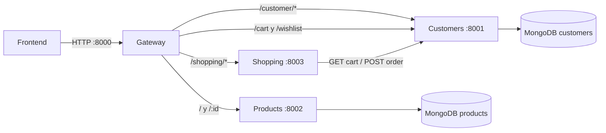

# Modelo de organizacion

Este repositorio contiene cuatro servicios independientes. Cada servicio tiene su propio `package.json`, `package-lock.json`, `Dockerfile`, `docker-compose.yml`, configuracion y base de datos. No existe una carpeta `shared/` ni un workspace de npm.

## Las cuatro capas

Cada dominio sigue esta separacion:

1. **API** (`src/api/`): define rutas HTTP, autentica peticiones y traduce entrada/salida.
2. **Servicio** (`src/services/`): contiene los casos de uso y coordina repositorios o llamadas a otros servicios.
3. **Repositorio** (`src/database/repository/`): encapsula consultas y cambios en MongoDB.
4. **Modelo y base de datos** (`src/database/models/`, `src/database/connection.js`): define esquemas y conexion persistente.

Las utilidades transversales de cada proceso viven en `src/utils/`. No deben importar repositorios de otro servicio.

## Regla de frontera

Un servicio no accede directamente al modelo ni al repositorio de otro servicio. La comunicacion entre dominios ocurre mediante HTTP y contratos publicos:

- `gateway` reenvia peticiones, pero no contiene reglas de negocio.
- `customers` es dueño de usuarios, perfiles, favoritos, carrito y pedidos persistidos.
- `products` es dueño del catalogo y los detalles de vehiculos.
- `shopping` coordina la creacion de pedidos y consulta el carrito de customers por HTTP. Su MongoDB queda preparada para una futura persistencia propia; hoy la orden se guarda en `customers`.

El carrito y los favoritos forman parte del documento del cliente. `shopping` no modifica `CustomerModel` directamente.

## Dependencias por dominio

Cada `package.json` declara solo las dependencias que su servicio utiliza:

- `products` mantiene tres dependencias de ejecucion: `dotenv`, `express` y `mongoose`. No carga criptografia ni librerias de autenticacion.
- `customers` necesita `dotenv`, `express`, `mongoose`, `jsonwebtoken`, `bcryptjs` y `cors`: las dos ultimas permiten cifrar contrasenas y aceptar peticiones del frontend.
- `shopping` declara sus dependencias de HTTP, autenticacion y persistencia para coordinar pedidos.
- `gateway` declara solamente las dependencias necesarias para proxy, CORS y configuracion.

La cantidad exacta puede cambiar si se modifica el contrato del servicio, pero una dependencia no debe agregarse a otro dominio solo para compartir codigo.

## Diagrama de arquitectura

## Contratos principales

### Gateway

- `GET /` lista productos.
- `GET /:id` obtiene un producto.
- `POST /customer/signup` registra un usuario.
- `POST /customer/login` inicia sesion.
- `GET /customer/profile` obtiene el perfil autenticado.
- `PUT /wishlist` y `DELETE /wishlist/:id` gestionan favoritos.
- `PUT /cart` y `DELETE /cart/:id` gestionan el carrito.
- `POST /shopping/order` crea un pedido.

Las rutas protegidas requieren `Authorization: Bearer <token>`.

### Flujo de una compra

1. El frontend obtiene un vehiculo desde `products` mediante el gateway.
2. El frontend envia el producto y la cantidad a `PUT /cart`.
3. `customers` guarda el carrito dentro del cliente autenticado.
4. `shopping` consulta el carrito de `customers`.
5. `shopping` calcula el total y envia la orden a `customers`.
6. `customers` guarda la orden y vacia el carrito. La base de datos de `shopping` queda disponible para futuras responsabilidades del dominio.

## Arranque

Para el arranque completo, primero deben estar disponibles MongoDB y los tres servicios de dominio. El gateway se levanta al final porque necesita encontrar `CUSTOMERS_URL`, `PRODUCTS_URL` y `SHOPPING_URL`.

Cada servicio puede ejecutarse de forma aislada para desarrollo. Las variables necesarias estan en su `.env.example`; los `.env` reales estan excluidos por el `.gitignore` de cada servicio.
